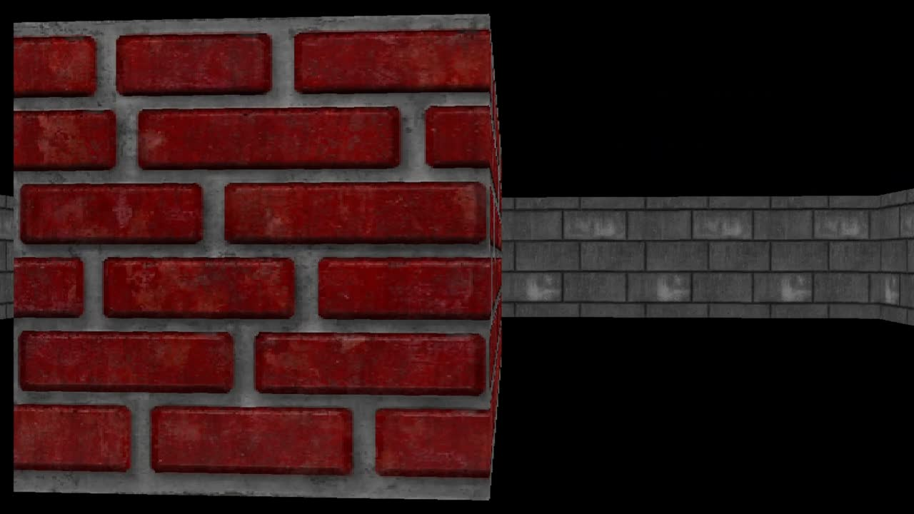
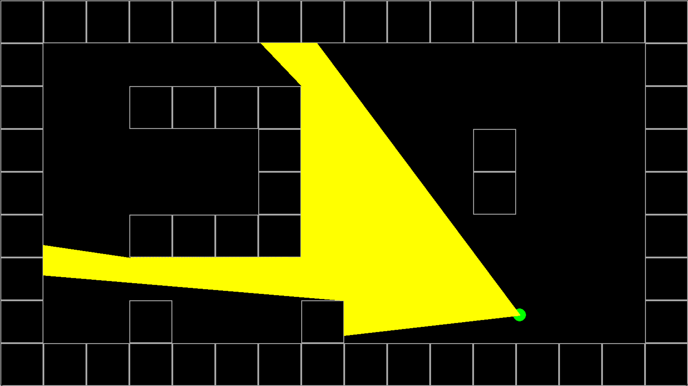

# 🔫 Projeto de Raycasting — Introdução à Computação Gráfica

Este projeto é uma simulação em Python de um mecanismo de renderização 3D usando **raycasting**, inspirado no clássico jogo **DOOM (1993)**. O objetivo foi compreender os fundamentos da renderização 3D a partir de uma visão em primeira pessoa, utilizando a biblioteca **Pygame** para criar uma visualização interativa.

---

## 🎮 O que o código faz?

- Simula a visão 3D de um jogador em um ambiente 2D com paredes texturizadas.
- Lança vários "raios" do jogador para detectar colisões com as paredes e calcular a profundidade.
- Renderiza as paredes com base na profundidade e na textura.
- Permite alternar entre **modo 3D (visão em primeira pessoa)** e **modo 2D (mapa com raios)** para fins de visualização e depuração.

---

## 📸 Imagem do Programa

| Visão 3D (padrão)                     | Visão 2D (debug com raios)        |
|--------------------------------------|------------------------------------|
|        |      |

---

## 📽️ Demonstração

> *(Adicione aqui uma imagem ou GIF do seu projeto rodando para deixar o repositório mais atrativo)*

## ⚙️ Como compilar e executar

### ✅ Requisitos

- Python 3.8+
- Pygame

### 📦 Instalação

1. Clone o repositório:

```bash
git clone https://github.com/seu-usuario/raycasting-doom.git
cd raycasting-doom
```


## 📦 Estrutura do Projeto

📁 projeto-raycasting/
├── main.py </br>
├── mapa.py </br>
├── player.py </br>
├── object_renderer.py </br>
├── settings.py </br>
├── raycasting.py </br>
├── textures/ </br>
│   └── 1.png </br>
│   └── 2.png </br>
│   └── 3.png </br>
│   └── 4.png </br>
│   └── 5.png </br>
├── imgs/ </br>
│   ├── visao_3d.png </br>
│   └── visao_2d.png </br>
├── README.md </br>


## 🎮 Controles
W, A, S, D – Movimentação do jogador

←, → – Rotação da câmera

ESC – Sair do jogo

## 🧠 Principais Conceitos Envolvidos
Trigonometria para cálculo de distâncias

Correção de distorção tipo "fish eye"

Projeção 2D de ambiente 3D

Manipulação de texturas com subsurface do Pygame


## 🧪 Modos de Visualização

Este projeto permite alternar entre dois modos:

- **Visão 3D (padrão):** paredes com texturas renderizadas em perspectiva.
- **Visão 2D (modo debug):** mapa visto de cima, com o jogador e raios emitidos.

### Como Alternar

- Para ver o **modo 2D**, edite o método `draw()`:
  - Comente a linha:
    ```python
    self.object_renderer.draw()
    ```
  - Descomente:## 
    ```python
    self.mapa.draw()
    self.player.draw()
    ```
  - E ative a linha de desenho dos raios no método `ray_cast`:
    ```python
    pg.draw.line(...)  # desenhar raios
    ```

- Para voltar à **visão 3D**, reverta essas alterações.

> ⚠️ Atenção: Quando estiver usando a visão 2D, os raios podem aparecer curvados nas extremidades.
> Isso acontece por conta da linha de correção do "efeito olho de peixe". Você pode comentá-la temporariamente para ver os raios retos:
> ```python
> # depth *= math.cos(self.game.player.angle - ray_angle)
> ```

##💡 Para visualizar os raios de luz (em ray_cast):

```python
# pg.draw.line(self.game.tela, "yellow",
#              (100 * ox, 100 * oy),
#              (100 * ox + 100 * depth * cos_a, 100 * oy + 100 * depth * sin_a),
#              2)
```
## 🐟 Sobre a correção do "efeito olho de peixe":

```python
depth *= math.cos(self.game.player.angle - ray_angle)
Essa linha corrige distorções na renderização 3D, mas pode deixar os raios "curvados" na visão 2D. Para testes, comente essa linha.
```

## 🛠 Principais problemas encontrados
Distorção do efeito olho de peixe, resolvida com correção do ângulo.

Diferenças na precisão entre intersecções horizontais e verticais.

Ajustes na escala e offset das texturas conforme a profundidade.

Dificuldade em visualizar os cálculos sem uma visualização 2D (debug).

## 🚀 Melhorias possíveis
Adicionar movimentação suave com interpolação.

Suporte a sprites (inimigos, objetos, etc.).

Sombras ou sombreamento por distância para maior realismo.

Detecção de colisões mais refinada.

UI para alternar entre modo 3D/2D sem editar o código.

## 👥 Equipe


| Integrante                           | Tarefa                             |
|--------------------------------------|------------------------------------|
| Vito Elias                           | Implementação do raycasting e renderização de objetos|
| Pedro Márcio                         | Implementação do mapa, player e arquivo de configurações|

## 👨‍💻 Autores
Desenvolvido por Vito Elias e Pedro Márcio  </br>
Projeto acadêmico para a disciplina de Introdução à Computação Gráfica

